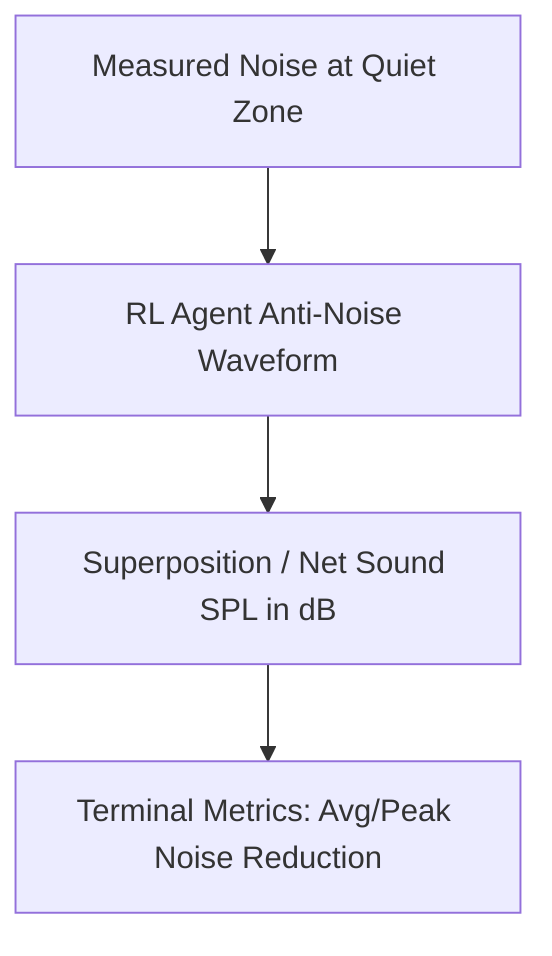

# Understanding PIRL-ANC Training Results & Checkpoints

This guide explains how to interpret and analyze the training outputs of the Physics-Informed Reinforcement Learning for Active Noise Control (PIRL-ANC) pipeline, specifically focusing on PyTorch checkpoint files (e.g., `pretrain_ep300.pt`).

---

## 1. What is inside a Checkpoint File?

The checkpoint files saved in the `pirl_anc/checkpoints/` directory are standard PyTorch serialized dictionaries containing the complete state of the Soft Actor-Critic (SAC) agent at a specific training episode.

When the agent's `save()` method is called, it persists:

*   **`actor_state_dict`**: The weight and bias matrices of the dual-headed policy network (`PIRLPolicyNetwork`). This network takes the acoustic observation vector and outputs the target control actions (amplitude and phase for each speaker).
*   **`critic_state_dict`**: The weights of the recurrent twin Q-networks (`TwinQNetwork`), which estimate state-action values.
*   **`critic_target_state_dict`**: The target networks used to stabilize Q-value targets.
*   **`actor_optimizer_state_dict` & `critic_optimizer_state_dict`**: The internal states of the Adam optimizers (momentum, learning rates, etc.).
*   **`config`**: Hyperparameters used to initialize the agent, including `state_dim`, `action_dim`, discount factor `gamma`, target update rate `tau`, entropy weight `alpha`, device, and physics penalty scaling factor `lambda_p`.

---

## 2. Interactive Visualization (Live Demo)

The most direct and visual way to evaluate the quality of a checkpoint is to run the interactive **Live Simulation Demo**. This simulates the room environment and animates the agent controlling anti-noise in real time.

### Run Command:
```bash
python -m pirl_anc.main --mode live_sim --checkpoint pirl_anc/checkpoints/pretrain_ep300.pt
```

### What to Look For:
The live demo displays a **3-panel Matplotlib animation**:



1.  **Panel 1 — Measured Noise**: Shows the target noise pressure signal at the quiet-zone location.
2.  **Panel 2 — Agent Anti-Noise Output**: Shows the anti-noise waveform (cyan) generated by the RL controller overlaying the remaining residual waveform (yellow). It also displays text annotations for each speaker's selected amplitude and phase.
3.  **Panel 3 — Net Sound (dB SPL)**: Plots the Sound Pressure Level over time. Look at the gap between the dashed red line (**Noise only**) and the solid yellow line (**After ANC**).
    *   **Successful learning** will show the yellow line consistently below the red line, with the terminal output reporting a positive **Average reduction** (e.g., $+6\text{ dB}$ to $+15\text{ dB}$).
    *   **Untrained or failing agents** will have the yellow line matching or exceeding the red line (causing noise amplification).

---

## 3. Analyzing Training Logs (`pretrain_log.csv`)

During simulation pretraining, progress statistics are saved in `pirl_anc/logs/pretrain_log.csv`. 

### Key Log Columns:
| Column | Description | Ideal Trend |
| :--- | :--- | :--- |
| `episode` | The training episode number. | Increasing |
| `total_reward` | The sum of step rewards accumulated over the episode. | Increasing (becoming less negative) |
| `critic_loss` | Mean squared temporal-difference error of the Q-networks. | Decreases and stabilizes |
| `actor_loss_sim` | Negative expected Q-values of the policy network in simulation. | Decreases (more negative, meaning higher expected reward) |
| `physics_loss` | Penalty term penalizing violations of the wave equations. | Decreases or remains consistently low |
| `steps` | Episode length in environment steps. | Constant (usually 135 or 200) |

### The Hybrid Reward & Annealing Schedule
The environment calculates rewards as:
$$\text{Reward} = -\frac{\alpha_{\text{reward}} \cdot \text{MSE}_{\text{time}} + \beta_{\text{reward}} \cdot \text{MSE}_{\text{freq}}}{100}$$

Where:
*   $\text{MSE}_{\text{time}}$: Time-domain squared pressure error (phase-sensitive).
*   $\text{MSE}_{\text{freq}}$: Frequency-domain spectral magnitude difference (phase-invariant, helps avoid the "silence trap").

> [!NOTE]
> During training, the weights $\alpha$ and $\beta$ are annealed linearly:
> *   **Early episodes**: $\alpha \approx 0.1$ and $\beta \approx 0.9$ (focuses on matching overall frequency profile and magnitude).
> *   **Late episodes**: $\alpha \rightarrow 1.0$ and $\beta \rightarrow 0.0$ (shifts focus to exact time-domain phase alignment).
>
> Because of this schedule, the absolute values of `total_reward` might temporarily drop (become more negative) in middle episodes as the task transitions to harder phase alignment, before recovering as the agent masters it.

---

## 4. Fine-Tuning on Real Hardware

Once you are satisfied with a simulation checkpoint (e.g., `pretrain_ep300.pt`), you can use it to initialize fine-tuning in a real hardware scenario or a more complex simulation:

```bash
python -m pirl_anc.main --mode finetune --checkpoint pirl_anc/checkpoints/pretrain_ep300.pt
```

This starts the fine-tuning process where the weights from `pretrain_ep300.pt` are loaded as the baseline, saving training time and preventing random exploration damage on real hardware speakers.

